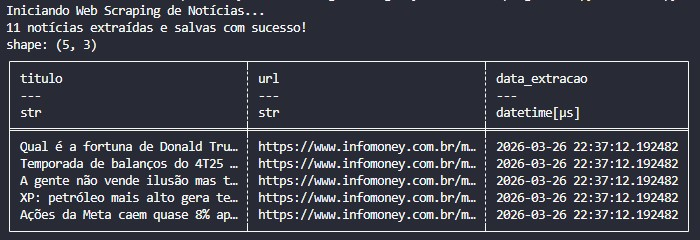

# 📰 Day 02: Web Scraping de Notícias (InfoMoney)

No segundo dia do desafio, o foco foi a extração de dados semi-estruturados (HTML) de portais de notícias financeiras, convertendo conteúdo web em datasets prontos para análise.

## 🎯 Objetivo
Desenvolver um scraper resiliente que capture manchetes e links de portais de notícias (Mercado Financeiro), tratando as variações de tags HTML e consolidando os dados em formato colunar.

## 🛠️ Stack Técnica
- **Linguagem:** Python 3.10+
- **Requisições:** `httpx` (com Headers de User-Agent para evitar bloqueios)
- **Parser HTML:** `BeautifulSoup4` com engine `lxml` (alta velocidade)
- **Processamento:** `Polars`
- **Armazenamento:** `Parquet` e `CSV`

## 🏗️ Lógica de Engenharia
Diferente de APIs, o Web Scraping exige técnicas para lidar com a instabilidade do DOM (Document Object Model):

1. **User-Agent Spoofing:** Simulação de um navegador real para evitar bloqueios de segurança (403 Forbidden).
2. **Seletores Abrangentes:** Busca baseada em tags de hierarquia (`h1`, `h2`, `h3`) em vez de classes CSS voláteis, garantindo maior vida útil ao script.
3. **Normalização de URLs:** Conversão de caminhos relativos (`/mercados/...`) em URLs absolutas.
4. **Data Cleansing:** Filtragem de ruídos (links de menu ou rodapé) baseada no comprimento da string do título.

## 🚀 Como Executar
1. **Instale as dependências:**
```bash
   pip install -r requirements.txt
```

2. **Rode o Scraper:**
```bash
    python main.py
```

3. **Este deve ser o resultado:**


## 📊 Estrutura de Saída
| Coluna | Descrição |
| :--- | ---: |
| titulo | Manchete da notícia extraída |
| url |	Link direto para a matéria completa |
| data_extracao | Timestamp do momento da coleta |

Este projeto faz parte do desafio #100DaysOfDataEngineering