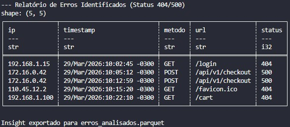

# 🔍 Day 04: Log Parser & Regex Filtering

No quarto dia do desafio, o foco foi a extração de inteligência a partir de arquivos de texto não estruturados. Simulamos um cenário real de monitoramento de servidores, onde precisamos identificar falhas críticas em logs de acesso.

## 🎯 Objetivo
Desenvolver um script capaz de ler arquivos de log no padrão Apache/Nginx, identificar erros de cliente (404) e erros de servidor (500) utilizando **Expressões Regulares (RegEx)** e estruturar esses dados para análise rápida.

## 🛠️ Stack Técnica
- **Linguagem:** Python 3.10+
- **Pattern Matching:** `re` (Regular Expressions com Named Groups)
- **Processamento de Dados:** `Polars`
- **Armazenamento de Insight:** `Parquet`

## 🏗️ Lógica de Engenharia
Diferente de um arquivo CSV ou JSON, logs de servidor são strings longas e complexas. A estratégia aplicada foi:

1. **Named Capturing Groups:** Utilizamos o padrão `(?P<name>...)` no RegEx. Isso torna o código mais legível e resiliente, permitindo acessar os dados extraídos por chaves (como um dicionário) em vez de índices numéricos.
2. **Filtro de Baixo Nível:** A filtragem dos códigos de status `404` e `500` é feita durante a leitura linha a linha, evitando que dados irrelevantes ocupem memória RAM.
3. **Conversão de Tipos (Casting):** Garantimos que o código de `status` seja tratado como inteiro pelo Polars, permitindo futuras agregações e cálculos estatísticos.

## 🚀 Como Executar
1. **Certifique-se de ter o arquivo `server_access.log` na mesma pasta.**

2. **Instale as dependências:**
```bash
   pip install polars pyarrow
```

3. **Execute o parser:**
```bash
   python main.py
```

## 📊 Output Esperado
O script gera um arquivo erros_analisados.parquet contendo as colunas:

- ip: Endereço de origem da requisição.
- timestamp: Data e hora exata do evento.
- metodo: Verbo HTTP (GET, POST, etc).
- url: O recurso que apresentou falha
-   status: O código de erro identificado.



Este projeto faz parte do desafio #100DaysOfDataEngineering

