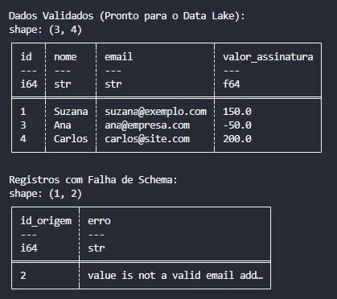

# 🛡️ Day 05: Data Quality com Pydantic

No quinto dia do desafio, implementamos uma camada de **Governança e Validação de Dados**. O objetivo foi garantir que apenas dados que respeitem o "contrato" definido pelo negócio sigam para o processamento final.

## 🎯 Objetivo
Validar um arquivo JSON de usuários, garantindo tipos de dados corretos (e-mails válidos, IDs positivos e valores financeiros maiores que zero) e separando registros íntegros de registros corrompidos para auditoria.

## 🛠️ Stack Técnica
- **Validação de Esquema:** `Pydantic V2`
- **Processamento de Dados:** `Polars`
- **Armazenamento:** `Parquet` (para dados validados)

## 🏗️ Conceitos de Engenharia Aplicados
1. **Schema Enforcement:** Utilizamos o `BaseModel` do Pydantic para definir regras rígidas. Se o dado de entrada não condiz com o esperado, o pipeline o rejeita imediatamente (**Fail-Fast**).
2. **Auditoria de Erros:** Em vez de simplesmente descartar os erros, o script os captura em um DataFrame separado (`df_fail`), permitindo identificar padrões de sujeira na origem dos dados.
3. **Dictionary Unpacking:** Uso de `**item` para instanciar classes de forma dinâmica e limpa.

## 🚀 Como Executar
1. **Instale as dependências:**
```bash
   pip install -r requirements.txt
```

2. **Execute o Validador**
```bash
    python main.py
```

3. **Este deve ser o resultado:**


##📊 Resultados
- usuarios_validados.parquet: Contém apenas os dados que passaram no teste de qualidade.

- Relatório de Erros: Exibição no console de quais registros falharam e por qual motivo técnico (ex: e-mail inválido).

Este projeto faz parte do desafio #100DaysOfDataEngineering