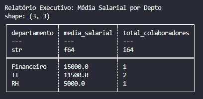

# 🗄️ Day 06: SQL Ingestion & Relational Queries

No sexto dia do desafio, avançamos para a camada de armazenamento persistente. O foco foi a integração do Python com bancos de dados relacionais utilizando o **SQLite**, uma ferramenta essencial para prototipagem e processamento de dados locais.

## 🎯 Objetivo
Consumir um banco de dados relacional já existente (`corporativo.db`), realizar junções (JOINs) entre tabelas de Funcionários e Departamentos, e extrair métricas salariais utilizando a performance do **Polars**.

## 🛠️ Stack Técnica
- **Banco de Dados:** `SQLite`
- **ORM/Engine:** `SQLAlchemy`
- **Processamento:** `Polars`
- **Exportação:** `CSV`

## 🏗️ Lógica de Engenharia
1. **Engine de Conexão:** Utilizamos o SQLAlchemy como ponte de comunicação. Essa abordagem é agnóstica ao banco, o que facilitaria a migração para um PostgreSQL ou SQL Server no futuro.
2. **SQL Pushdown:** Em vez de trazer todas as tabelas para a memória do Python e fazer o merge lá, executamos um `JOIN` e um `GROUP BY` diretamente na engine do banco. Isso reduz drasticamente o consumo de memória RAM.
3. **Persistência de Dados:** Diferente de arquivos temporários, o uso do `.db` permite que os dados persistam entre diferentes execuções do pipeline.

## 🚀 Como Executar
1. **Certifique-se de que o arquivo `corporativo.db` foi gerado (ou use o script de setup).**
2. **Instale as dependências:**
```bash
   pip install -r requirements.txt
```
3. **Execute o motor de insights:**
```bash
    python main.py
```
4. **Este deve ser o resultado:**


Este projeto faz parte do desafio #100DaysOfDataEngineering