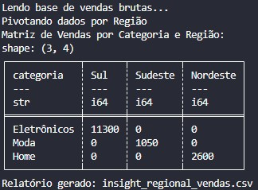

# 🔄 Day 07: Data Reshaping & Feature Engineering (Pivot/Melt)

No sétimo dia do desafio, avançamos para a manipulação de estruturas de dados complexas. O foco mudou de dados estáticos para a **Ingestão de Arquivos CSV** e a transformação de tipos (Casting e Datetime) para gerar relatórios matriciais.

## 🎯 Objetivo
Processar uma base de vendas bruta (`vendas_brutas.csv`), extrair dimensões temporais e rotacionar a matriz de dados para comparar a performance financeira entre diferentes categorias de produtos e regiões geográficas.

## 🛠️ Stack Técnica
- **Linguagem:** `Python 3.10+`
- **Processamento:** `Polars` (Engine de alta performance)
- **Operações:** `Pivot`, `Melt`, `Feature Engineering (dt.month)`

## 🏗️ Lógica de Engenharia de Dados
1. **Ingestão de Dados Reais:** Leitura de arquivo externo com inferência de tipos e parsing automático de datas.
2. **Feature Engineering:** Criação de colunas derivadas (`mes_num`) a partir da coluna de data original para permitir o agrupamento temporal.
3. **Data Pivot (Long to Wide):** Transformação das regiões (Sul, Sudeste, Nordeste) de valores de linha em colunas de cabeçalho, agregando o valor total de vendas.
4. **Data Cleansing:** Aplicação de `.fill_null(0)` para garantir que combinações de Categoria/Região sem vendas não quebrem o relatório final.

## 🚀 Como Executar
1. **Certifique-se de que o arquivo `vendas_brutas.csv` está na mesma pasta.**
2. **Instale as dependências:**
```bash
   pip install polars
```
3. **Execute o processador:**
```bash
    python main.py
```

## 📊 Saída Esperada
O script gera o arquivo insight_regional_vendas.csv, que apresenta uma visão executiva ideal para consumo em ferramentas de BI ou planilhas de fechamento mensal.


Este projeto faz parte do desafio #100DaysOfDataEngineering