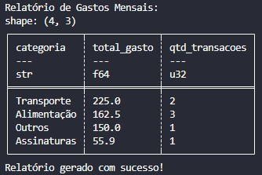

# 💳 Day 08: Categorizador de Gastos Bancários

No oitavo dia, apliquei técnicas de engenharia de dados para o setor financeiro, transformando uma fatura de cartão de crédito bruta em um relatório categorizado de consumo.

## 🎯 Objetivo
Processar transações bancárias em formato CSV e aplicar lógica de mapeamento de strings para classificar gastos e gerar um resumo executivo por categoria.

## 🛠️ Stack Técnica
- **Processamento:** `Polars`
- **Lógica:** `Expressões Condicionais (When/Then)`
- **Output:** `CSV Agregado`

## 🏗️ Lógica de Negócio
1. **Normalização:** Leitura de strings complexas de faturas.
2. **Classificação:** Uso de Regex para identificar palavras-chave (ex: "UBER" -> "Transporte").
3. **Agregação:** Cálculo de somatório e contagem por grupo de gasto.

## Resultado Esperado
