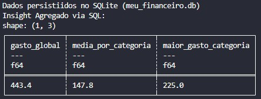

# 🗄️ Day 09: SQLite Manager & SQL Aggregation

No nono dia, o foco foi a transição da memória para a persistência. Criei um banco de dados relacional local para armazenar os resultados dos processamentos anteriores.

## 🎯 Objetivo
Demonstrar a integração entre o processamento em memória (**Polars**) e o armazenamento relacional (**SQLite**), utilizando SQL puro para extrair métricas globais.

## 🛠️ Stack Técnica
- **Engine SQL:** `SQLAlchemy`
- **Banco de Dados:** `SQLite`
- **Orquestração:** `Polars`

## 🏗️ Fluxo de Dados
1. **Ingestão:** Leitura do CSV processado no Dia 08.
2. **Persistência:** Escrita automatizada no banco `meu_financeiro.db`.
3. **Analytics:** Execução de funções de agregação (`SUM`, `AVG`, `MAX`) via SQL para gerar um report executivo.

## Resultado esperado
