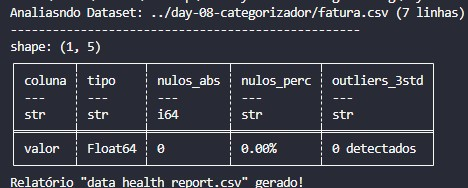

# 📊 Day 10: Data Profiling Automático

O foco é a **Observabilidade de Dados**. Criei um motor de profiling que analisa a integridade de qualquer dataset de forma programática.

## 🎯 Objetivo
Desenvolver uma ferramenta de auditoria de dados para identificar falhas de preenchimento (nulos), anomalias estatísticas (outliers) e conformidade de tipos de dados.

## 🛠️ Stack Técnica
- **Engine:** `Polars`
- **Conceitos:** `Standard Deviation (Outliers)`, `Data Integrity`, `Metadata Analysis`

## 🏗️ Funcionalidades
1. **Null Analysis:** Cálculo percentual de vacância por coluna.
2. **Anomaly Detection:** Identificação de outliers baseada em 3 desvios padrão (Z-Score > 3).
3. **Audit Trail:** Geração de um CSV de saúde para governança de dados.

## Resultado esperado
