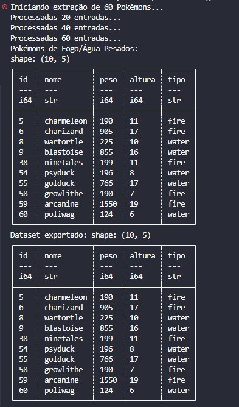

# 🐲 Day 11: Pokedex API - Paginação e Filtros

No décimo primeiro dia, elevei o nível de consumo de APIs, focando em técnicas de extração em lote (Batch Extraction) e paginação.

## 🎯 Objetivo
Construir um pipeline que navegue por múltiplos endpoints da PokeAPI, trate a paginação via parâmetros de `offset` e aplique filtros complexos em memória utilizando o motor Polars.

## 🛠️ Stack Técnica
- **Ingestão:** `Requests` (com parâmetros de query)
- **Processamento:** `Polars` (Filtros booleanos e List check)
- **Fonte:** `PokeAPI`

## 🏗️ Conceitos Aplicados
1. **API Pagination:** Gerenciamento de limites e deslocamentos para extração controlada.
2. **Data Transformation:** Conversão de JSON aninhado para estrutura tabular.
3. **Multi-criteria Filtering:** Uso de operadores lógicos no Polars para segmentação de dados.

## Resultado Esperado
