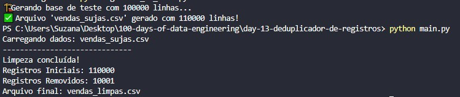

# 🧹 Dia 13: Deduplicador de Registros com Polars
## 🎯 Objetivo
Desenvolver um algoritmo de limpeza de dados de alta performance para identificar e remover registros duplicados em grandes bases de dados (Big Data), garantindo a integridade da informação para processos de Analytics e Engenharia de Dados.

## 🚀 Tecnologias Utilizadas
Python 3.x
Polars: Biblioteca de manipulação de dados em Rust, focada em performance e processamento paralelo.
NumPy: Utilizado na geração de dados sintéticos para testes de estresse.

## 🧠 O Problema
Em pipelines de dados reais, é comum a ocorrência de duplicatas devido a:
    - Falhas em sistemas de origem (double-tap).
    - Re-execução de processos de ingestão sem limpeza prévia.
    - Mesclagem de fontes de dados distintas com sobreposição.

## 🛠️ Implementação Técnica
1. **Geração de Dados (Data Synthesis)**
Para validar o algoritmo, foi desenvolvida uma rotina que gera um dataset de 110.000 registros, injetando propositalmente 10% de duplicatas aleatórias, simulando um ambiente de produção real.

2. **Algoritmo de Limpeza**
Diferente do Pandas tradicional, utilizamos o Polars pelo seu motor de execução multithreaded.
    - Critério de Unicidade: O script considera um registro duplicado apenas se houver colisão nas colunas ID_CLIENTE, DATA_VENDA e VALOR.
    - Keep Policy: Mantemos a primeira ocorrência (first) para preservar a cronologia original.

## Resultado esperado

## 📁 Como Executar
1. Clone o repositório.
2. Instale as dependências: pip install polars numpy.
3. Execute o gerador de base: python gerar_base.py.
4. Execute o deduplicador: python main.py.

## 📁 Como Executar
1. **Clone o repositório.**
2. **Instale as dependências listadas no arquivo requirements.txt**
3. **Execute o gerador de base: python gerar_base.py.**
4. **Execute o deduplicador: python main.py.**