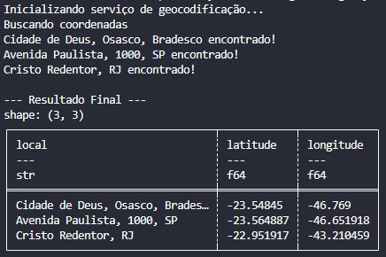

# 🌍 Dia 14: Geocodificação de Endereços com Polars

## 🎯 Objetivo
Transformar dados de texto não estruturados (endereços residenciais ou comerciais) em dados geográficos estruturados ($Latitude$ e $Longitude$). Este processo é fundamental para análises espaciais, logística e inteligência de mercado.

## 🚀 Tecnologias Utilizadas
- Python 3.10+
- Polars: Manipulação de dados de alta performance.
- Geopy: Cliente para serviços de geocodificação.
- Nominatim (OpenStreetMap): API de geocodificação aberta.

## 🧠 O Problema
Dados de endereço costumam ser armazenados como strings simples. Para realizar cálculos de distância, roteirização ou visualização em mapas, o Engenheiro de Dados precisa converter essas strings em coordenadas numéricas, lidando com:
1. Limites de Requisição (Rate Limiting): APIs de geocodificação costumam bloquear acessos em massa.
2. Tratamento de Exceções: Endereços mal formados que não retornam resultados.
3. Alinhamento de Dados: Garantir que a estrutura da tabela (DataFrame) se mantenha íntegra mesmo quando uma busca falha.

## 🛠️ Implementação Técnica
### 1. Integração com API
Utilizamos a classe Nominatim com um user_agent personalizado e o RateLimiter da biblioteca Geopy. Isso garante que o script respeite o intervalo de 1 segundo entre as requisições, evitando o banimento do IP.

### 2. Fluxo de Transformação 
O script percorre a coluna de locais, faz a chamada à API e popula listas de Latitude e Longitude. Caso um endereço não seja encontrado, inserimos um valor null (None) para manter o Shape do DataFrame correto.

```bash
    location = geocode(endereco)
    if location:
        lats.append(location.latitude)
        lons.append(location.longitude)
```

## 📊 Resultado Esperado
O script processa uma base de teste e gera um arquivo enderecos_geocodificados.csv pronto para ser consumido por ferramentas de BI ou bibliotecas de mapas.

