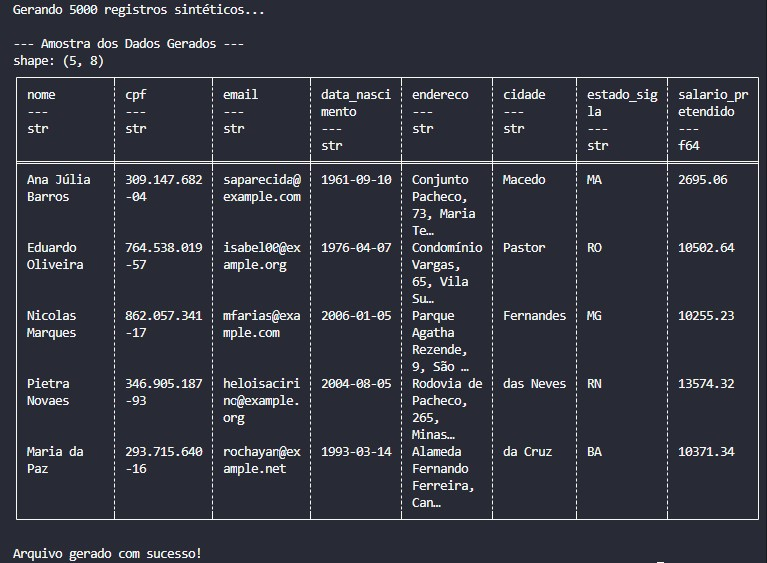

# 🎭 Dia 15: Geração de Dados Sintéticos com Faker & Polars

## 🎯 Objetivo
Criar datasets realistas para testes de pipelines de dados, garantindo a conformidade com leis de privacidade (LGPD) e permitindo testes de estresse em larga escala.

## 🚀 Tecnologias
- Faker: Geração de dados (Nomes, CPFs, Endereços brasileiros).
- Polars: Estruturação e exportação ultra-rápida.

## 🛠️ O que foi feito
- Configuração do Locale pt_BR para garantir que os dados (como CPF e endereços) sigam o padrão brasileiro.
- Geração de campos complexos como datas de nascimento com faixas etárias específicas e salários aleatórios.
- Exportação de 5.000 registros em milissegundos usando o motor do Polars.

## Resultado Esperado
