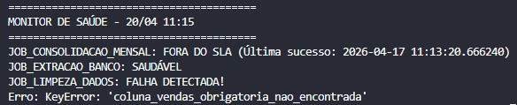

# 🛠️ Dia 17: SLA & Health Check Monitor
O objetivo é implementar um sistema de observabilidade local para monitorar a saúde e a pontualidade de pipelines de dados.

---

## 📝 Descrição do Projeto
Em ambientes de produção, é crítico saber se um Job falhou ou se ele simplesmente não rodou (atraso de SLA). Este projeto automatiza essa verificação através da análise de arquivos de Heartbeat (.success) e arquivos de Log de Erro (.error).

---

### Principais Funcionalidades:
- Monitoramento de SLA: Verifica se o último sucesso do job ocorreu dentro da janela de tempo esperada (ex: 24h).

- Análise de Falhas: Captura automaticamente a última exceção registrada em arquivos de erro para facilitar o debug.

- Dashboard em Terminal: Interface visual simples para identificar rapidamente jobs saudáveis, falhos ou atrasados.

---

## 📂 Estrutura de Arquivos
```bash
dia17-health-check/
├── logs/               # Diretório simulado de saída dos Jobs
├── main.py             # Script principal do Monitor
├── setup_teste.py      # Script utilitário para simular cenários de falha/SLA
└── README.md           # Documentação do desafio
```

---

## 🚀 Como Executar
1. Preparar o Ambiente
Primeiro, gere os dados de teste para simular diferentes comportamentos de jobs:

```bash
python setup_teste.py
```

2. Rodar o Monitor
Execute o monitor para validar o status atual de todos os processos:

```bash
python main.py
```

---
## Resultado Esperado


---

## 🧠 Aprendizados do Dia 17
- Manipulação de Metadados: Uso da biblioteca os para verificar carimbos de modificação de arquivos (mtime).

- Lógica de SLA: Implementação de cálculos de tempo com datetime e timedelta para garantir que os dados estão atualizados.

- Observabilidade: Compreensão da importância de sinalizadores de sucesso/erro em sistemas distribuídos.