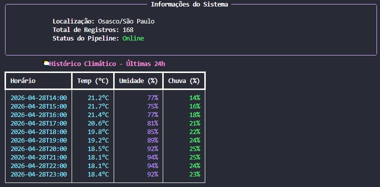

# 📊 Dia 21: CLI Dashboard (Visualização com Rich)
O foco aqui é a Observabilidade, transformando dados brutos de um CSV em uma interface rica e legível diretamente no terminal.

---

## 📝 Descrição do Projeto
Como Engenheira de Dados, muitas vezes operamos em ambientes de servidor (via SSH) onde não há interface gráfica. Este projeto utiliza a biblioteca Rich para criar um dashboard de linha de comando (CLI) que permite monitorar rapidamente o status dos dados coletados, facilitando a tomada de decisão técnica.

Principais Funcionalidades:
- Tabelas Dinâmicas: Renderização de dados estruturados com alinhamento e estilos profissionais.

- Formatação Condicional: Implementação de lógica visual onde a cor da temperatura muda (ex: Ciano para frio, Vermelho para calor) baseada nos valores do dataset.

- Painéis de Status: Centralização de metadados do sistema (localização, total de registros e status do pipeline) em componentes visuais destacados.

- Tratamento de F-Strings: Manipulação avançada de strings para acesso a dicionários dentro de expressões de formatação.

---

## 📂 Estrutura de Arquivos
```bash
day-21-data-viz/
├── main.py                  # Script do Dashboard utilizando Rich
├── historico_climatico.csv  # Fonte de dados gerada no Dia 20
└── README.md                # Documentação do desafio
```

---

## 🚀 Como Executar
1. Instalação da Biblioteca
É necessário instalar a biblioteca Rich no seu ambiente:

```bash
pip install rich
```

2. Execução
Com o arquivo historico_climatico.csv na mesma pasta, execute:

```bash
python main.py
```

---

## Resultado Esperado


---

## 🧠 Aprendizados do Dia 21
- UX para Engenharia: A importância de criar ferramentas que facilitem a leitura de logs e dados para a equipe de dados.

- Escopo de F-Strings: Resolução de erros de sintaxe (SyntaxError) ao alternar corretamente entre aspas simples e duplas em expressões complexas.

- Componentização: Uso de Layout, Panel e Table para organizar a saída do console de forma modular.